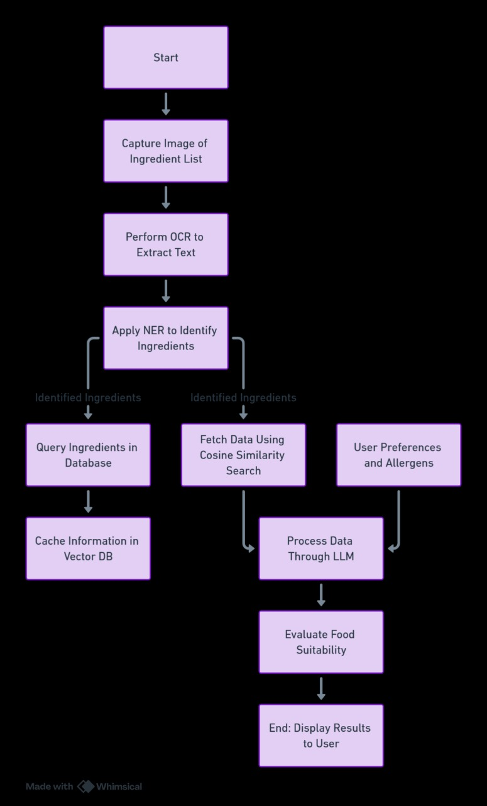

# Health Guard
## Team CultMango, Team #20

# https://healthguardpro.streamlit.app/

#### PS: In the contemporary fast-paced world, the usage of packaged goods has become ubiquitous. However, the complexity and obscurity of ingredient labels can lead to confusion, health risks, and dietary non-compliance for many consumers. Individuals with specific dietary preferences or allergies often find it challenging to navigate the myriad of chemical and derivative names listed on packaging, potentially leading to unintended consumption of harmful or undesired ingredients.

- Personalized User Profiles: Users input information about their health conditions, allergies, and fitness goals during signup or login
- Product Scanning and Analysis: Using mobile device cameras, users can scan product ingredients
- Real-time Feedback: The application provides real-time feedback on scanned products, indicating if they align with the user's dietary needs or pose potential risks
By combining web scraping for data acquisition and LLMs for intelligent analysis, HealthGuard ensures a robust and dynamic system that empowers users to make informed and health-conscious decisions.
- Alternative Product Suggestions: For products that may cause issues, HealthGuard suggests alternative options that better suit the user's health requirements

## Technologies Used
- Python
- streamlit
- transformers
- pytorch
- LLMs: Mistral-7B-Instruct-v0.1
- OCR: fine tuned donut OCR model
- Vector DB: ChromaDb

## Screenshots (see the ss folder)

